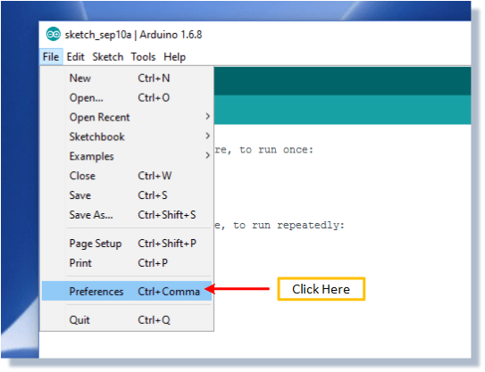
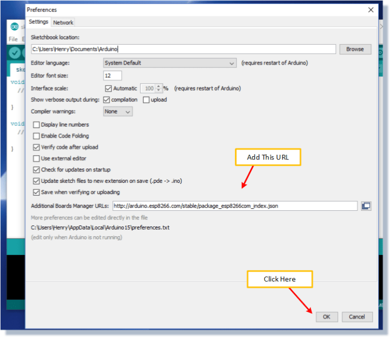
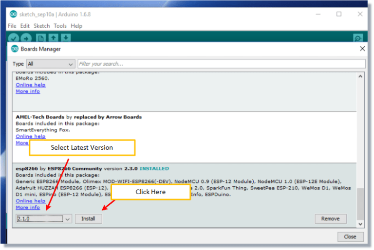
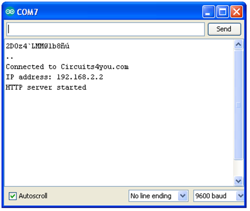
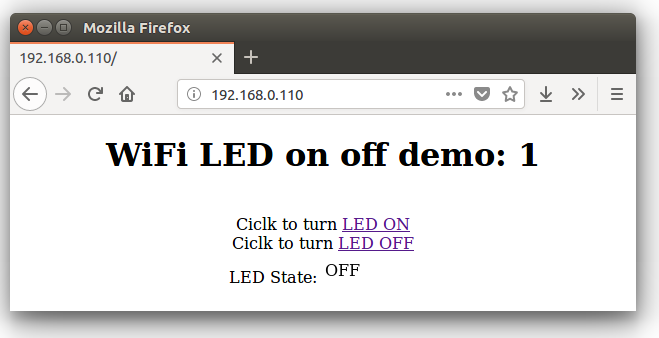

# Wifi-ESP8266-Lolin
Arduino-LAB
##Preparing the Arduino IDE to Work with the NodeMCU Module
Don’t get intimidated.  These are relatively painless steps.
##Go To ‘Preferences’
###Select “Preferences” via the File Menu.

##Add A URL
###Type “http://arduino.esp8266.com/stable/package_esp8266com_index.json” into the field for ‘Additional Boards Manager URL’.

##Install the ESP8266 Files
###From the boards manager pop up, scroll until you find the esp8266 board.   Select the latest version and install.

## ESP8266 Web Server with HTML Web Page

#### A Web server is a program that uses HTTP (Hypertext Transfer Protocol) to serve the files that form Web pages to users, in response to their requests, which are forwarded by their computers’ HTTP clients.
#### To implement web server on ESP, there are two ways to make your first web server first connect to your WiFi router or make ESP as access point.
# index.h file
#### Now we import this header file in our program using #import “index.h”. Make sure that this file must be with arduino code file .ino

# Results

### Example 1: Simple LED on Off Control from web page.

